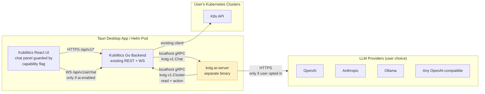

# Kubilitics ↔ kotg.ai Integration Design

**Date:** 2026-04-18
**Status:** Approved for implementation
**Scope:** Architectural boundary between kubilitics core and the kotg.ai AI layer. Not prompts, not tool list, not UI details.

---

## 1. Summary

Run the AI layer as a **separate sidecar binary** built from the `kotg.ai` repo. Kubilitics core never imports kotg.ai code. The two talk over a localhost gRPC contract defined in a small shared schema module. A single config flag, `ai.enabled`, controls whether kubilitics spawns the sidecar and registers the AI route prefix. When the sidecar is absent or the flag is off, the AI does not exist: no goroutines, no endpoints, no menu items, no dependencies in the running process. This gives us the hardest possible boundary, independent crash and release domains, and a believable "off" state — all things the alternatives only approximate.

---

## 2. Options considered

### A. UI-only toggle — AI compiled into the main backend, flag hides it

Cheapest to ship today. One binary. Easy local dev. But every kubilitics build now drags in the LLM clients, MCP server code, embedding libs, prompt templates, safety analyzers, and the entire kotg.ai dependency closure. "Off" only hides the menu — the goroutines, network code, and attack surface still exist. CVE in any AI dep ships to every user, AI on or off. **Reject.**

### B. Runtime subsystem behind an interface, nil impl when disabled

Better than A in code structure: a clean Go interface, a no-op default, real impl loaded when the flag is on. But the AI deps are still compiled in — same bloat, same supply chain, same security surface. The boundary lives only in convention; one well-meant `import "github.com/kubilitics/kotg/internal/..."` from a kubilitics package and the boundary leaks. Reviewing for that drift forever is real cost. **Reject.**

### C. Separate sidecar process — kotg.ai is its own binary

Kubilitics spawns kotg-ai-server on startup if `ai.enabled=true`. Talks over loopback gRPC. If the binary is missing, AI silently doesn't exist. Kubilitics has zero kotg.ai source dependencies — only the tiny shared schema module. The boundary is the OS process line; you literally cannot accidentally call across it. AI crashes, OOMs, or hangs in a tool-calling loop don't take down the user's k8s management tool. AI ships its own release cadence. AI can be omitted entirely from compliance-restricted distributions by not packaging the binary. Cost: process lifecycle work, IPC contract design, slightly more complex install. All of that is bounded, one-time work. **Choose this.**

### D. Plugin/extension system

We have one plugin idea. Building a plugin system to host one plugin is wrong. It buys us nothing C doesn't, costs more, and pretends we know what plugins #2 and #3 will look like (we don't). **Reject.** Revisit if and when we have a real third-party extension story.

### Choice: **C — sidecar process**

The deciding factors are privacy-first and "off means off". Both are listed as hard constraints. Only C delivers them in a way a security review can verify with `lsof` and `ps`, not by reading source.

---

## 3. Boundary diagram



The yellow `AI` box exists at runtime only when `ai.enabled=true` AND the binary is present. Everything else stays the same.

---

## 4. Feature flag design

The flag has **two layers** because they answer different questions.

**Layer 1 — distribution.** The kotg-ai-server binary is either packaged with the kubilitics distribution or it isn't.

- Desktop: shipped as a Tauri sidecar binary, opt-out via a build tag (`-tags noai`) for compliance-restricted variants.
- Helm: a separate sub-chart `kubilitics-ai` deployed as its own Deployment. Default `ai.enabled=false` in `values.yaml`. Operator decides whether to install it at all.

This is the hard answer to "what if our customer can't use AI for legal reasons". They install kubilitics, never see the binary, never get a CVE alert about an LLM client they don't run.

**Layer 2 — runtime.** A single config field:

```yaml
ai:
  enabled: false                # master switch
  endpoint: "127.0.0.1:0"       # 0 = pick a free port; sidecar reports back
  startTimeoutSec: 10
  binaryPath: ""                # optional override; default = colocated with kubilitics binary
```

Read once at startup in the existing `internal/config` package. Never re-read; restart to change.

**How the backend enforces it.** When `ai.enabled=false`:

- The AI route group is never registered on the mux. `POST /api/v1/ai/chat` returns 404, not 503. Routes that don't exist can't be exploited.
- The sidecar supervisor is never constructed.
- No goroutines, no ports, no log lines mentioning AI.

When `ai.enabled=true`:

- Backend tries to spawn the sidecar binary. Fails closed: if the binary is missing or won't start, AI routes still aren't registered and capability reports `enabled: false, error: "binary not found"`. We don't pretend AI is on.

**How the frontend discovers it.** One read-only endpoint:

```
GET /api/v1/capabilities
→ {
    "ai": {
      "enabled": true,
      "version": "0.4.1",
      "providers": ["openai", "anthropic", "ollama"],
      "models": ["gpt-4o-mini", "claude-3-5-sonnet", "llama3.1:70b"]
    },
    "rbac": {...},
    "audit": {...}
  }
```

The React app calls this once on app load, stores the result in a Zustand store, and gates the chat panel, the menu item, the keyboard shortcut, and any "Ask Kubi" entry points on `capabilities.ai.enabled`. No conditional API calls, no try/catch. If `enabled` is false, the AI components aren't even mounted — same code path as if those components didn't exist.

**How we prevent accidental coupling.** Two mechanisms:

1. **CI import lint.** A `go vet` plugin (or a tiny script using `go list -deps`) runs on every PR to kubilitics. It walks the import graph from `cmd/server` and the desktop sidecar entrypoint, then fails the build if any path matches `github.com/kubilitics/kotg/...` other than the explicit shared schema module. This is the wall.
2. **Architecture decision log.** This document. Every PR touching `internal/ai/*` cites it. Reviewers reject anything that adds a kotg.ai source dep.

---

## 5. Module boundary

Everything that crosses the wire goes through one Go module: **`github.com/kubilitics/kotg-schema`**. Just protobuf + generated Go + a small Go client and server stub. Versioned semver. Both repos depend on it. Neither repo depends on the other directly.

**What the core exposes (kotg-schema/cluster.proto):**

```
service ClusterRead {
  rpc GetCluster(GetClusterRequest) returns (Cluster);
  rpc ListResources(ListResourcesRequest) returns (stream ResourceItem);
  rpc GetResource(GetResourceRequest) returns (Resource);
  rpc GetLogs(GetLogsRequest) returns (stream LogLine);
  rpc GetEvents(GetEventsRequest) returns (stream Event);
  rpc Topology(TopologyRequest) returns (TopologyGraph);
}

service ClusterAction {
  // Every Action carries the user's session token so it inherits
  // existing RBAC and lands in the audit log via the normal path.
  rpc Apply(ApplyRequest) returns (ApplyResult);
  rpc Delete(DeleteRequest) returns (DeleteResult);
  rpc Scale(ScaleRequest) returns (ScaleResult);
  rpc Exec(ExecRequest) returns (stream ExecChunk);  // fenced; needs approval
}
```

**What the AI exposes:**

```
service Chat {
  rpc CreateSession(CreateSessionRequest) returns (Session);
  rpc Send(stream UserMessage) returns (stream AssistantEvent);
  rpc CancelTurn(CancelTurnRequest) returns (Empty);
  rpc ListSessions(ListSessionsRequest) returns (stream Session);
}

service AIControl {
  rpc Capabilities(Empty) returns (AICapabilities);
  rpc Health(Empty) returns (HealthStatus);
}
```

**Rule for what may cross.** Schema types only. No kubilitics internal models, no Zustand types serialized to wire, no Go-specific values. If a field needs to cross the boundary, it gets a proto definition. No `interface{}` smuggling. This is annoying on day one and saves us six months in.

**Authentication at the boundary.** Per-call user token in metadata. The AI sidecar holds no permanent credentials of its own — every cluster read or write is performed under the human user's identity, by the kubilitics core, after the standard RBAC and audit checks. The AI never gets a kubeconfig. It never bypasses kubilitics to talk to the K8s API directly. This is what makes safety-gating real.

---

## 6. Versioning and independent release

Three artifacts, three release lines:

- **kubilitics** (core): semver `vX.Y.Z`. Today: v1.0.0.
- **kotg-ai-server**: semver `vA.B.C`. Tracks the kotg.ai repo's own release. Initial v0.x — explicitly experimental.
- **kotg-schema**: semver `vM.N.O`. The contract.

**Compatibility rule.** The kubilitics binary at startup negotiates with the AI sidecar via `AIControl.Capabilities`. The response includes `schema_version`. If the major versions don't match, the supervisor logs a clear error, marks AI unhealthy, and `/api/v1/capabilities` reports `enabled: false, reason: "schema_incompatible"`. The user sees a toast. We never quietly cross-talk incompatible versions.

**Breaking-change policy on the schema.**

- Patch and minor: additive only. New fields, new RPCs, new optional metadata. Old clients keep working.
- Major: requires a coordinated release. Bump kubilitics to a version that supports both old and new schema for one minor (overlap window of ~3 months). Ship the new AI side. Then drop the old after the overlap.

This means **AI can ship features fast** behind additive schema changes. The core only blocks AI when AI needs to break the contract.

---

## 7. Testing strategy

Three CI matrices.

**Core-only build.** `make test-core` runs `go test ./...` in the kubilitics repo with an explicit assertion: zero `kotg`-prefixed packages in the import graph. Implemented as a CI step that runs `go list -deps ./cmd/server | grep -E 'kotg|github.com/kubilitics/kotg' && exit 1`. The build fails on any leak. This is the wall against drift.

**AI-enabled integration.** `make test-integration` builds both binaries, starts the AI sidecar with a stub LLM (deterministic responses), spawns kubilitics core wired to a fake K8s API server (envtest), runs scripted chat scenarios end-to-end. Catches IPC contract breaks the moment they happen. Runs on every PR to either repo.

**AI-disabled-at-runtime smoke.** A focused test: start kubilitics with `ai.enabled=false`. Then assert:

- `/api/v1/capabilities` returns `ai.enabled: false`.
- `/api/v1/ai/chat` returns 404 (not 503, not 401).
- `lsof` shows no kotg-ai-server process owned by the test PID.
- The process's open file descriptors include none of the kotg.ai data dirs.
- The runtime profile shows no goroutine whose name or stack contains `kotg`.

This is the test that proves "off means off" to a security reviewer. Cheap to write, expensive if we ever skip it.

**Frontend.** Vitest unit tests pass with `mockCapabilities({ ai: { enabled: false } })` and assert no chat-panel components are rendered, no AI routes are reachable from the React Router config, no analytics events fire.

---

## 8. Architectural risks and mitigations

**1. Dependency creep.** The single biggest risk. Some PR will add `import "github.com/kubilitics/kotg/internal/something"` to a kubilitics file because it's "easier". *Mitigation:* CI import lint described above. It's a hard wall. Plus an architecture review checklist on any PR touching `internal/ai/` or `cmd/server/main.go`.

**2. Flag rot.** Features that only work with the flag on. Bugs that only happen with the flag off. Nobody tests the off state. *Mitigation:* the core test suite **runs with AI off by default**. AI tests are in a separate suite that requires the sidecar to be reachable. New features are core features unless someone justifies otherwise.

**3. Binary-size bloat.** Not applicable to C — the whole point is the AI binary is separate. Kubilitics core stays slim.

**4. User confusion ("where is the AI panel?").** A user installs and wonders why the chat icon is missing. *Mitigation:* Settings → AI Assistant section is **always** visible, even when AI is off. It shows: status (off / on / sidecar unreachable), reason, and a one-click "Enable" that flips the flag and restarts the AI subsystem. Discovery > magic.

**5. Sidecar lifecycle bugs.** Process leaks, zombies, restart loops, port conflicts. *Mitigation:* Tauri already manages sidecars for the existing kubilitics-backend binary — same pattern, well-trodden. For Helm: a normal Deployment with restart policy, liveness probe on the AI's `Health` RPC, resource limits set so a runaway AI can't OOM the cluster. We do NOT roll our own process supervisor.

**6. IPC version drift.** Kubilitics v1.5 ships, AI v1.0 still installed; they disagree about a field. *Mitigation:* capability handshake at startup. Fail loudly with a user-facing error. Never silently misbehave. Plus the major-version overlap window in schema policy.

**7. Latency on actions.** Adding a process hop slows things down. *Mitigation:* AI chat is conversational — humans tolerate hundreds of ms. The hop is local Unix domain socket where possible (Tauri desktop), localhost TCP otherwise. Real bottleneck is the LLM, which dwarfs any IPC overhead.

**8. Per-cluster vs shared sidecar.** **Single shared sidecar.** The AI session is bound to the user, not the cluster — same chat can ask about any cluster the user has access to. This is what makes "Kubi" feel like a real assistant rather than a per-cluster bot. Implications for multi-tenant Helm installs are out of scope for v1 of this design and need a follow-up spec; flagging it now so we don't pretend it's solved.

---

# Runtime Concerns Addendum

The architectural design above answers "where does code live and who depends on whom." This addendum closes the eight runtime concerns: safety, observability, cost, sessions, concurrency, failure UX, transport security, and streaming.

## 9. AI Action Gateway

**Decision:** the safety layer lives in **kubilitics core**, not in the AI sidecar. The AI is treated as an untrusted actor calling on behalf of the user.

Every cluster mutation crosses through one place: `internal/ai/gateway`. The gateway sits between the kotg-schema `ClusterAction` server impl and the existing kubilitics action handlers. It does three things:

1. **Classifies the action** into one of four risk tiers, computed deterministically from the verb + resource + namespace, never from the LLM:

   | Tier | Examples | Approval |
   |------|----------|----------|
   | `read` | get, list, watch, logs, describe | Auto |
   | `write_safe` | label, annotate, scale up to N | Banner only ("Kubi just scaled web 3→5"); user can revert |
   | `write_risky` | apply manifest, scale down, edit secret | Inline confirm dialog with diff before execute |
   | `destructive` | delete, exec, rollout restart, drain node | Modal: action summary + diff + RBAC check + explicit "I authorize" |

2. **Enforces RBAC.** The user's session token from gRPC metadata is replayed against the existing kubilitics auth middleware. The AI cannot do anything the human can't already do. We never grant the AI its own service account.

3. **Writes the audit row first, then performs the action.** The audit row carries `actor=user@host`, `agent=kotg-ai`, `model=claude-3.5-sonnet`, `session_id`, `prompt_excerpt` (first 200 chars, redacted via existing `pkg/redact`), and the full diff. If the user later asks "why did the cluster change at 2am" the answer is in the standard audit log next to every other action.

**Prompt-injection defense.** Three rules:

- The tool result format is fixed JSON. The AI cannot use a `<system>` block in tool output to grant itself elevated authority — the gateway ignores any "approval signal" from the LLM and only honors signals from the human via the UI.
- Resource content fetched from the cluster (logs, configmap data, events) is wrapped in `<untrusted_data>` markers in the prompt context. The reasoning engine in kotg.ai is configured to never execute instructions found inside those markers.
- The action gateway re-validates every action's target. If the LLM says "delete pod X" but the previous tool call was about pod Y in another namespace, the gateway flags a context mismatch and requires explicit user re-confirmation.

Today the policy is hardcoded Go. Deeper policy modeling is in §17.

---

## 10. Observability

**OpenTelemetry traces** propagate end-to-end. The UI generates a trace ID per turn, sends it on the WebSocket connect, kubilitics core forwards it in gRPC metadata to the AI, the AI attaches it to LLM provider HTTP calls and to every `ClusterRead` / `ClusterAction` callback. One Jaeger view shows the whole turn: prompt assembly → tool calls → LLM → action gateway → cluster API.

**Prometheus metrics** on both sides:

```
# AI sidecar
ai_turns_total{provider, model, status}             # status: ok|error|cancelled|timeout
ai_turn_duration_seconds{provider, model}           # histogram
ai_tokens_total{provider, model, direction}         # direction: in|out
ai_tool_calls_total{tool, status}
ai_provider_errors_total{provider, code}            # rate-limit, auth, etc.

# kubilitics core (AI gateway)
ai_actions_total{tier, decision}                    # decision: auto|confirmed|denied|rbac_denied
ai_action_duration_seconds{tier}
ai_session_active                                   # gauge
ai_session_started_total{user}
```

The sidecar exposes `/metrics` on a separate port that kubilitics core scrapes (so you don't need a separate Prometheus job). When AI is off, the metrics simply don't exist — same "off means off" rule as the rest of the system.

**Logging.** Both sides emit structured JSON logs with trace ID + session ID. Existing kubilitics logger contract (slog) is the kotg-schema standard for log fields so a single `loki` query can correlate.

---

## 11. Rate limiting and cost control

Three concentric limits. Each fail-closed: when the limit is hit the next message gets a clear error, not a silent drop.

**Per-user token budget.** Configurable, default `100k tokens/day` per user. Stored in kubilitics core's existing DB (the AI is stateless about this; it asks core "may I spend 4000 input + 800 output tokens for user X?" before invoking the LLM). Core checks, increments, returns yes/no. This means users on shared installs can have different budgets via the existing user model.

**Per-session ceiling.** Default `200k tokens` per chat session. Hitting the ceiling forces a new session — also forces the user to consciously start a fresh context window, which is healthy.

**Per-cluster tool-call rate.** AI tool calls hit the actual cluster API. Default `30 calls/minute per cluster per user`, token bucket with burst 60. Prevents an agent loop from accidentally DoS-ing a customer's prod cluster. We already have `golang.org/x/time/rate` everywhere — same pattern.

**Provider 429 handling.** kotg.ai already has retry with exponential backoff. New requirement: when the provider 429s persistently (>30s), the AI sidecar surfaces a typed `provider_quota_exhausted` event up the chat stream. UI shows: "Anthropic rate-limited. Switch model? [OpenAI] [Ollama] [Wait]". User picks. No silent stalls.

**Global kill switch.** A single config field `ai.killswitch=true` immediately rejects all in-flight and new turns with a user-visible "AI temporarily disabled by admin" message. Two reasons it exists: cost runaway response (intern leaves the office with an open chat that loops), and incident response (suspected prompt-injection compromise — admin needs one switch to stop everything).

---

## 12. Sessions and memory

**Definition.** A session is one chat conversation, identified by `(user_id, session_id)`. Created on first message; deleted when the user closes the chat or 7 days of inactivity (configurable).

**Storage layout, three tiers:**

- **Hot turn state** — current message, in-flight tool calls, partial assistant tokens. Lives in the AI sidecar's memory. Lost on sidecar restart (the in-flight turn errors with "session interrupted, please retry"). Acceptable; turns are seconds.
- **Session transcript** — the full message history for the conversation. Persisted by **kubilitics core** in its existing DB (next to audit, RBAC, projects). The AI sidecar holds no permanent transcript. Reason: privacy + the same DB already has the access controls. AI sidecar fetches the transcript via a `Sessions.Get(session_id)` RPC at the start of each turn.
- **Session summary** — a compressed summary of older turns when the live transcript would exceed the LLM context. Generated by the AI itself once per N turns, stored alongside the transcript. Lets long sessions stay coherent without ballooning input tokens. Implementation deferred to v1.1; v1.0 just truncates oldest turns when the budget hits.

**Multi-cluster context.** Each session has a `focus_cluster_id`. Defaults to the user's currently-active cluster in the kubilitics UI. Changes when the user switches the cluster picker mid-chat OR when the user explicitly says "switch to prod-eu-west" (the AI calls a `SetFocusCluster` action which goes through the gateway, not magic). The AI can read across clusters in one turn (cross-cluster questions are valuable) but writes are scoped to `focus_cluster_id` unless the user confirms a cross-cluster operation explicitly.

---

## 13. Multi-user concurrency

The AI sidecar is one process serving many users. Two limits:

- **Global concurrent turns:** `MAX_CONCURRENT_TURNS` (default 10). Implemented as a buffered channel in the chat handler. New turns past the limit get queued for up to `QUEUE_TIMEOUT_SECONDS` (default 5) then rejected with `429 ai_busy`.
- **Per-user concurrent turns:** 1. If a user sends a new message while their previous turn is still streaming, the AI **cancels the previous turn** (`CancelTurn` semantics from §5) and starts the new one. This matches user intent — they're done with the old answer.

**Backpressure to the UI.** When queue depth > 50% of capacity, the chat panel shows a small "Kubi is handling other requests, your turn will start shortly" indicator. Prevents the user from spamming Send and making it worse.

**Helm scaling.** AI sidecar Deployment supports `replicaCount > 1`. Sessions are routed by `session_id` consistent-hash so one user's conversation always lands on the same replica (keeps the hot in-memory tool-call state local). Pod loss = that user's in-flight turn errors; their next message creates a fresh session on a new pod and reads transcript from core.

---

## 14. Failure fallback UX

| Failure | What the user sees |
|---|---|
| LLM provider 5xx (transient) | Spinner + "Retrying..." (silent retry up to 3x with backoff) |
| LLM provider down (final) | "Anthropic is unreachable. Switch provider? [OpenAI] [Ollama] [Cancel]" |
| LLM provider quota | "Daily token budget hit. Resets at midnight UTC. [View usage]" |
| LLM timeout (>30s) | If partial tokens streamed: keep them + "...response was cut short, ask again to continue". Otherwise: "Kubi took too long. Try a more focused question." |
| Tool execution failure | AI receives the error in its context and decides — usually it tells the user "I tried to fetch logs for pod X but got: <error>. Want me to try a different approach?" |
| Action gateway denies (RBAC) | "Your account doesn't have permission to delete deployments in 'prod'. Ask your admin or pick a different action." |
| Sidecar crash mid-turn | UI shows "Kubi disconnected — restarting..." with a 5s countdown. Sidecar restarts via Tauri/Helm. UI reconnects. The interrupted turn is lost; user re-sends. |
| Sidecar permanently down | `/api/v1/capabilities` flips `ai.enabled=false` after 3 failed health checks. Chat panel collapses to a "AI assistant offline — see Settings" link. No spinning forever. |

Key principle: **never silent**. Every failure has a typed event class, a user-facing message, and a next action. Loading states are bounded.

---

## 15. mTLS even on localhost

"Localhost is trusted" doesn't survive contact with shared compute. Adopting mutual TLS regardless:

- At sidecar startup, the AI generates a self-signed cert + key in a tmpfs directory. The cert pin is written to a file kubilitics core reads on its own startup.
- Every gRPC connection uses TLS with cert pinning in **both** directions. Random processes on the host cannot dial the AI's port and replay actions.
- Per-call: the user's session token is in gRPC metadata. The AI sidecar validates it against kubilitics core (`Auth.Verify` RPC) before serving the chat call. So even with a stolen cert, requests without a valid live user token are rejected.
- For Helm multi-pod deployment: cert material lives in a Kubernetes Secret rotated by the chart's pre-install hook. SPIFFE/SPIRE deferred — see §17.

This is cheap to add upfront and impossible to retrofit cleanly.

---

## 16. Streaming UX behavior

The chat is **token-by-token streamed** via gRPC server-streaming → forwarded over WebSocket to the React UI. Three event types over the wire:

```
AssistantEvent {
  oneof event {
    TextDelta text_delta        = 1;  // partial assistant tokens
    ToolStart tool_start        = 2;  // "Looking up pods in default..."
    ToolEnd   tool_end          = 3;  // "Found 14 pods"
    ActionPending action_pending = 4; // gateway is waiting for user approval
    Error     error             = 5;
    Done      done              = 6;  // turn complete; carries token usage stats
  }
}
```

**UI rendering.** Text deltas accumulate into the assistant bubble with a blinking cursor. Tool start/end render as small inline indicators ("🔍 Looking up pods in `default`...") that collapse into a one-liner on completion ("Looked up 14 pods"). This is what makes the assistant feel like a senior engineer thinking out loud rather than a black box.

**Cancellation.** The Stop button on the chat panel calls `CancelTurn(session_id, turn_id)`. The AI sidecar:

1. Cancels the in-flight LLM call (provider clients support this).
2. Aborts any in-flight tool executions where safe.
3. Emits a final `Done{cancelled: true, partial: true}` event so the UI marks the message as interrupted.

**Reconnect resilience.** If the WebSocket drops mid-turn, the UI reconnects and resubscribes to the session. The AI sidecar buffers the last 200 events per active turn so a 5-second drop doesn't lose the assistant's answer. Beyond 200 events: the user sees what arrived, and the next action is "ask Kubi to continue".

---

## 17. Deferred (Intentionally Out of Scope for v1)

Each item has a stated reason and a stated trigger for revisit. Not "we'll get to it" — "we'll get to it when X."

| Item | Why deferred | When to revisit |
|---|---|---|
| **OPA-based policy engine** for AI action approval | Hardcoded tier policy ships first; OPA adds complexity without usage signal | First customer asks for org-defined policies |
| **Long-term cross-session memory** | Privacy + relevance + cost are all unsolved at the same time; weak demand | Re-evaluate after 6 months of session-only usage data |
| **Multi-tenant AI sidecar** for shared installs | Tenant isolation is a separate architecture, not an extension | Dedicated v2 spec when first multi-tenant deployment is requested |
| **SPIFFE/SPIRE workload identity** | Localhost mTLS + per-call user tokens are sufficient for v1 | When zero-trust posture or scale-out across hosts arrives |
| **Cost reporting UI** | Prometheus metrics are exposed; ops can dashboard those today | After 90 days of real token-cost data shapes a useful view |
| **Advanced AI safety policies** (deep prompt-injection defense, contextual risk scoring beyond the 4 tiers) | v1 ships the action gateway + tier classifier + untrusted-data marker pattern; deeper modeling needs real attack patterns to design against | **v1.5**, driven by observed misuse + threat-modeling pass |
| **Intelligent multi-provider routing & fallback** | v1 has manual provider switching on quota errors; automatic routing requires provider-health telemetry we don't have yet | When ≥2 providers are in regular customer use and instability is observed |
| **Dedicated AI observability dashboards** | v1 emits OTel traces + Prometheus metrics; ops use existing Grafana/Jaeger | When a customer asks for a turnkey "AI ops" view, build a Grafana JSON pack |
| **AI reasoning / explainability trace** for compliance | v1 captures the prompt excerpt + diff + token usage in audit; full chain-of-thought logs are a privacy and storage concern | When a regulated-industry customer requires it; gate behind an opt-in flag |

---

The design above is the smallest one that satisfies the hard constraints without faking them. Sidecar isolation + capability-gated UI + a small typed contract is more work than baking AI into the binary for the next two weeks. It is much less work than baking AI into the binary for the next two years.

Defer the rest until real signal demands it.
